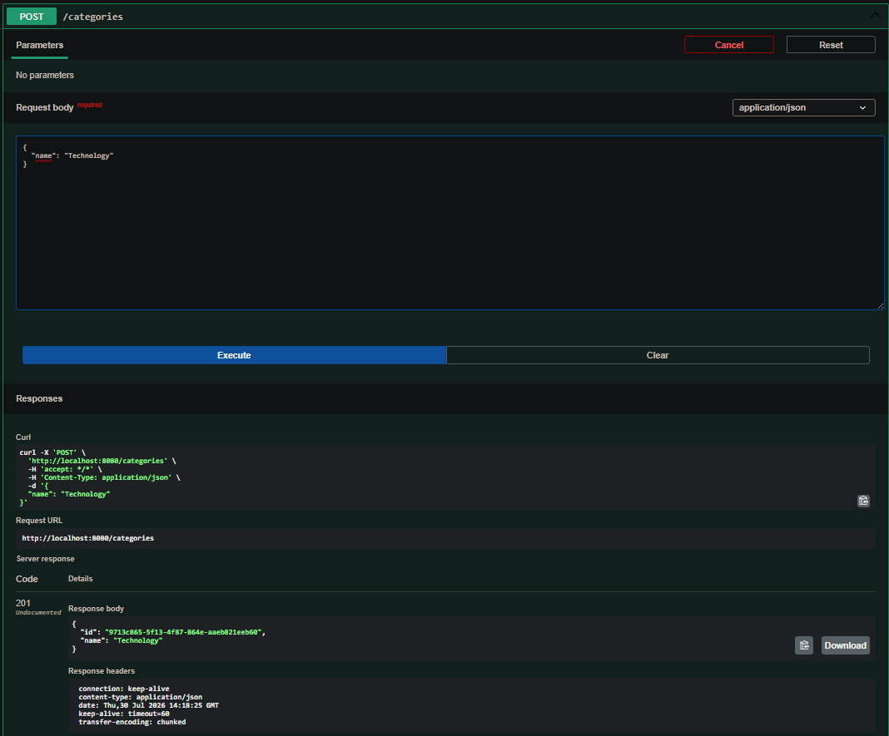
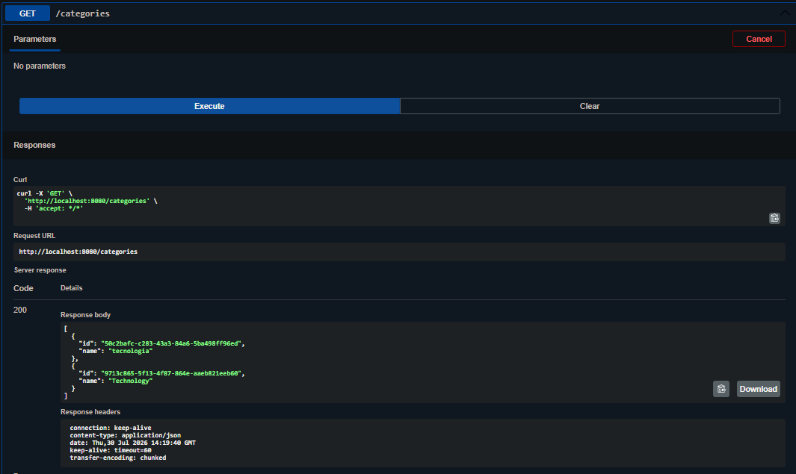
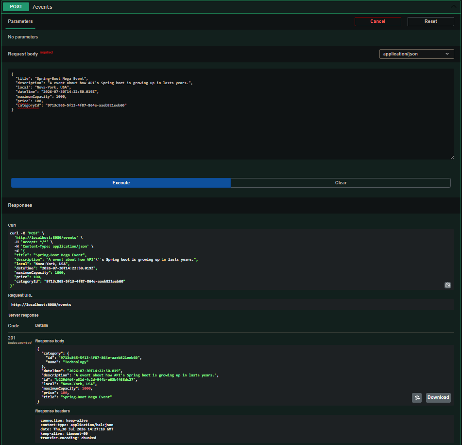

# 🎟️ EventHub API

> A modern RESTful API built with **Java 21** and **Spring Boot 3** designed for managing events, categories, participant registrations, and ticket availability tracking.

---

## 📌 About the Project

**EventHub API** is a backend application developed to handle event management and user booking workflows. The project adheres to software engineering best practices, emphasizing **Clean Code**, **Layered Architecture (Controller-Service-Repository)**, **DTO patterns**, and automatic schema generation via JPA/Hibernate.

---

## 🚀 Tech Stack

* **Language:** Java 21 (LTS)
* **Framework:** Spring Boot 3
* **Web / REST:** Spring Web (MVC)
* **Data Access:** Spring Data JPA / Hibernate
* **Database:** PostgreSQL
* **Containerization:** Docker & Docker Compose
* **Validation:** Jakarta Bean Validation
* **Build Tool:** Maven

---

## ✨ Key Features

* 📅 **Event Management:** Full CRUD operations for events (title, description, date/time, venue, maximum capacity, price).
* 🗂️ **Category Organization:** Group events into categories (e.g., *Tech*, *Workshops*, *Concerts*, *Meetups*).
* 👥 **Participant Management:** Register attendees with validated fields (Email, Name, ID).
* 🎟️ **Registration & Booking:** Handle user registrations with automated capacity checks and duplicate booking protection.
* ⚠️ **Global Exception Handling:** Custom exception handling (`@ControllerAdvice`) providing clear HTTP responses (`400 Bad Request`, `404 Not Found`).

---

## 🛠️ Getting Started

### Prerequisites


* [Docker Desktop](https://www.docker.com/products/docker-desktop/) installed and running.
* [Git](https://git-scm.com/) installed.

*(Optional for local non-containerized dev: Java JDK 21+ and Maven)*

---

## 🐳 Running with Docker (Recommended)

The easiest way to run the full application (API + PostgreSQL Database) is using Docker Compose.

git clone [https://github.com/BarbosaMatheu/event-hub.git](https://github.com/BarbosaMatheu/event-hub.git)
cd event-hub

### Navigate to the project directory:

``` Bash
 cd event-hub
```
### Build and start the containers:

```Bash
docker compose up --build
```

### Access the API:

**API Root: http://localhost:8080**

PostgreSQL: localhost:5432 (User: postgres, Password: postgrespassword, DB: eventhub_db)

### Stop the application:

```Bash
docker compose down
```

## ⚙️ Local Development (Without Docker)

If you prefer running PostgreSQL and Spring Boot locally on your host machine:

Configure your PostgreSQL credentials in src/main/resources/application.properties:


``` 
### Database Configuration
spring.datasource.url=jdbc:postgresql://localhost:5432/eventhub_db
spring.datasource.username=postgres
spring.datasource.password=YOUR_POSTGRES_PASSWORD
spring.datasource.driver-class-name=org.postgresql.Driver

# JPA / Hibernate
spring.jpa.hibernate.ddl-auto=update
spring.jpa.show-sql=true
spring.jpa.properties.hibernate.format_sql=true
spring.jpa.database-platform=org.hibernate.dialect.PostgreSQLDialect

```
# Run the application using Maven:
``` Bash
./mvnw spring-boot:run
```

# 📸 API'S Demonstration (Swagger UI)

## Creating a New Category!



## Fetching all Categories!


## Creating a New Event!
